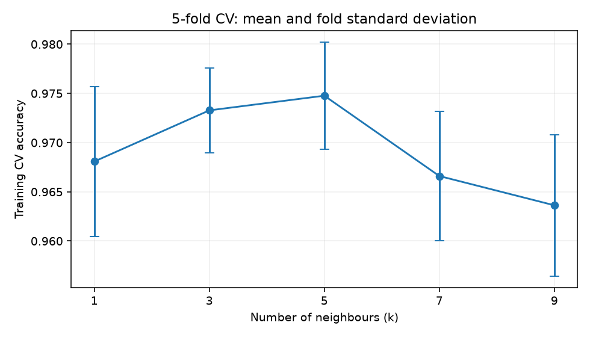
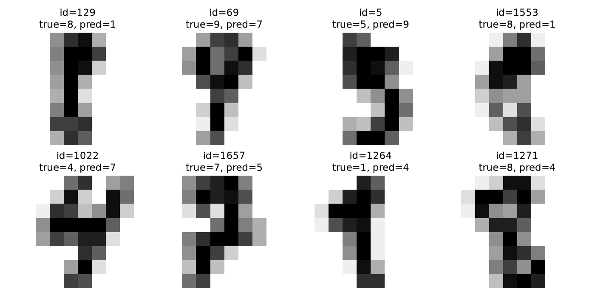

# 手写数字分类：模型对照、交叉验证与错误分析

**Digits Classification · SVM / KNN · scikit-learn**

我想通过这个项目，把机器学习课程里的数据、训练、预测和评估连起来。目标是逐步做到：自己能运行、能修改，也能解释结果从哪里来。

目前仓库提供可运行的实验、分步骤 Notebook 和结果分析。我把它作为继续学习图像分类的起点；个人复现与理解进度记录在 [学习任务](LEARNING_TASKS.md) 中。

## 先看这几处

| 内容 | 入口 |
|---|---|
| 逐步运行：数据 → 参数选择 → 测试 → 错误分析 | [experiment.ipynb](experiment.ipynb) |
| 看懂关键概念和代码 | [入门阅读指南](docs/BEGINNER_GUIDE.md) |
| 查看实际结果、原因猜测与限制 | [实验报告](docs/EXPERIMENT_REPORT.md) |
| 一次运行完整实验 | [experiment.py](experiment.py) |
| 核查预测、参数和运行环境 | [results](results/) |

## 实验结果

2026-10-07 验证运行：共 1797 张图片，训练集 1347 张，测试集 450 张；固定随机种子 42。

| 模型 | 参数选择 | 测试准确率 | 正确 / 错误 |
|---|---|---:|---:|
| 标准化 + SVM（RBF） | 预设 C=1，gamma=scale | 98.00% | 441 / 9 |
| 标准化 + KNN 基线 | 预设 k=5 | 96.44% | 434 / 16 |
| 标准化 + KNN，训练集 CV 选参 | k∈{1,3,5,7,9}，选出 k=5 | 96.44% | 434 / 16 |

**这次交叉验证选出的 k 与基线相同，测试结果没有提升。** SVM 在这次划分中少错 7 张；单次实验不能证明它在所有数据上都更好。





## 实验怎么做

1. 加载内置 digits 数据，无需另外下载；每张 8×8 图片展开为 64 个特征。
2. 按类别比例划分训练与测试数据；两部分没有重叠。
3. 将标准化和模型放入同一条 Pipeline。每次训练只使用相应训练部分拟合标准化。
4. 在训练集内做五折交叉验证，按平均准确率选择 KNN 的 k；测试集不参与选参。
5. 用全部训练数据拟合模型，在固定测试集上评估；输出逐类报告、混淆矩阵和错误图片。
6. 保存所有测试预测、划分索引、依赖版本和代码指纹，方便复查。

## 如何运行

在下载后的仓库文件夹打开终端。验证环境为 Python 3.12；完整版本见 [environment.txt](results/environment.txt)。不需要 GPU。

### Windows PowerShell

```powershell
python -m venv .venv
.\.venv\Scripts\python.exe -m pip install -r requirements.txt
.\.venv\Scripts\python.exe experiment.py
.\.venv\Scripts\python.exe verify_results.py
```

### macOS / Linux

```bash
python3 -m venv .venv
.venv/bin/python -m pip install -r requirements.txt
.venv/bin/python experiment.py
.venv/bin/python verify_results.py
```

预期输出中的关键行：

```text
Selected k=5 using training CV only
svm: accuracy=0.9800, errors=9
knn: accuracy=0.9644, errors=16
knn_tuned: accuracy=0.9644, errors=16
```

运行会更新 `results/` 中的生成文件。安装首次需要网络，实验数据由 scikit-learn 提供。依赖范围见 `requirements.txt`；如需尽量匹配已发布结果，可使用 `pip install -r results/environment.txt` 安装记录中的关键包版本。不同环境仍可能有差异。

### 在 VS Code 运行 Notebook

安装 VS Code 的 Python、Jupyter 扩展，然后执行：

```powershell
.\.venv\Scripts\python.exe -m pip install -r requirements-notebook.txt
```

打开 `experiment.ipynb`，选择仓库 `.venv` 中的 Python 作为内核，从上到下运行。Notebook 与脚本调用同一份实验函数，结果保存到同一个目录。

## 仓库结构

```text
experiment.py                  完整实验入口
digits_workflow.py             数据、交叉验证、评估与保存函数
experiment.ipynb               分步骤学习入口
verify_results.py              结果一致性检查
requirements*.txt              核心 / Notebook 依赖
LEARNING_TASKS.md               我的实际学习与修改记录
docs/                          阅读指南、实验报告
results/                       数值结果、预测明细、图像、运行记录
```

## 我的下一步

- 按 Notebook 运行，解释图片形状、训练与测试的区别。
- 找到三张错误样本，写下直接观察与尚待验证的猜测。
- 自己完成一个修改，再记录代码、实际输出和仍不理解的内容。

具体练习与验收标准见 [LEARNING_TASKS.md](LEARNING_TASKS.md)。

## 来源与范围

参考 [scikit-learn 官方数字识别示例](https://scikit-learn.org/stable/auto_examples/classification/plot_digits_classification.html)。本仓库采用自己的固定分层划分、标准化 Pipeline、KNN 对照及训练集交叉验证，数值不与官方示例直接比较。数据说明见 [load_digits 文档](https://scikit-learn.org/stable/modules/generated/sklearn.datasets.load_digits.html)，预处理方式参考 [避免数据泄漏的说明](https://scikit-learn.org/stable/common_pitfalls.html)。

代码、文档和验证运行由 AI 助手协助完成；个人独立复现与修改以学习记录为准。项目范围是小规模数字分类实验，尚未评估真实照片、医学影像、跨数据集表现或部署效果。
