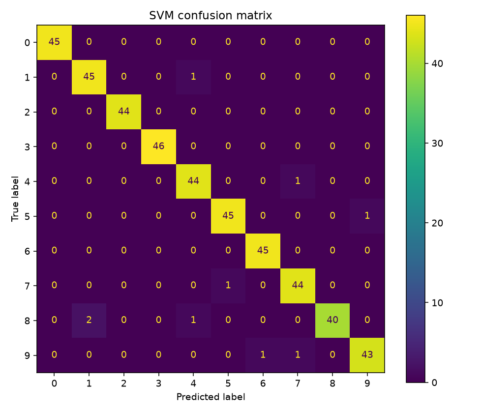

# 手写数字分类：复现与错误分析

一个用于学习图像分类完整流程的实验仓库。基于 scikit-learn 内置 digits 数据，比较 SVM 与 KNN，并生成分类报告、混淆矩阵和错误图片。

## 当前状态与来源

- 代码和文档由 AI 助手协助生成，作为学习起点。
- 仓库运行结果不代表学习者已独立掌握；个人理解、修改和复现实验记录见 `LEARNING_TASKS.md`，待实际完成后填写。
- 参考：[scikit-learn 官方手写数字识别示例](https://scikit-learn.org/stable/auto_examples/classification/plot_digits_classification.html)。本仓库重新编写实验流程，并增加固定划分下的 KNN 对照、训练集拟合的标准化和错误样本输出。
- 这是教学数据实验，不是医学影像模型或临床应用。

## 运行

建议 Python 3.10 或更新版本。在仓库目录运行：

```bash
python -m venv .venv
# Windows PowerShell
.venv\Scripts\python -m pip install -r requirements.txt
.venv\Scripts\python experiment.py
```

macOS/Linux 使用 `.venv/bin/python` 替换上面的 Python 路径。

## 实验设计

1. 将每张 8×8 灰度图展开为 64 个像素特征。
2. 分层划分训练集与测试集，测试比例 25%，随机种子 42。
3. 标准化仅在训练集上拟合，通过 Pipeline 应用于测试集。
4. 固定参数比较 SVM 与 KNN；不根据测试集反复挑选参数。
5. 保存准确率、每类分类报告、混淆矩阵、前八个错误样本。

结果位于 `results/`，实际使用的软件版本见运行后保存的 `environment.txt`。

## 助手验证的基线结果

2026-10-05，助手在 Python 3.12 环境执行本仓库脚本，训练集 1347 条，测试集 450 条。以下结果来自真实运行，尚待学习者在自己的流程中复现与解释。

| 模型 | 测试准确率 |
|---|---:|
| 标准化 + SVM | 98.00% |
| 标准化 + KNN（k=5） | 96.44% |




## 如何解读

这是一次固定划分的基线比较，不能说明某种模型普遍更好。前八个错误样本不是随机抽样，也不能代表全部错误。后续参数选择应使用训练集内的验证或交叉验证，测试集留作最后评估。

## 学习者下一步

先完成任务清单中的代码解释，再做一个独立修改，并记录真实输出。只有实际完成的任务才勾选。
